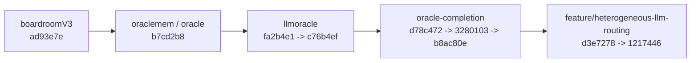

# Oracle Branch Change Summary

## Scope

This document compares the Oracle development paths starting from `oraclemem` and explains how the codebase diverged toward:

- `oracle-completion` for causal `oracle_v4` / `oracle_v4_causal`
- `origin/feature/heterogeneous-llm-routing` for the `oracle_v3_hetero` / heterogeneous-LLM path

It is designed to answer three questions:

1. What is the real git ancestry?
2. What is the correct `oracle_v3` baseline?
3. Which files changed for causal-v4 work versus heterogeneous-LLM work?

## Important Mapping

- `oraclemem` = `b7cd2b8` (`Oracle v1`)
- `oracle-completion` = `b8ac80e` (`Oracle Completed`)
- `v3_hetero` in this repo corresponds to:
  - branch: `origin/feature/heterogeneous-llm-routing`
  - tip commit: `12174469ff843f2d714069dadce5d88569dc94bc`

## Executive Summary

- `oraclemem` is the common git ancestor for both later lines.
- The true `oracle_v3` memory-aware baseline is not `oraclemem`; it is introduced later in `llmoracle`.
- `oracle-completion` is the branch that implements causal `oracle_v4` and `oracle_v4_causal`.
- `feature/heterogeneous-llm-routing` is not a sibling branch off `oraclemem`; it is built on top of `oracle-completion`.
- So the hetero branch inherits the full causal-v4 stack and then adds its own LLM-routing layer.

## Actual Git Lineage

The real git ancestry is:

### Merge-base facts

- `merge-base(oraclemem, oracle-completion)` = `b7cd2b8`
- `merge-base(oraclemem, origin/feature/heterogeneous-llm-routing)` = `b7cd2b8`
- `merge-base(oracle-completion, origin/feature/heterogeneous-llm-routing)` = `b8ac80e`

That means:

- `oracle-completion` does branch from the `oraclemem` line
- `feature/heterogeneous-llm-routing` does not branch directly from `oraclemem`
- the hetero branch is layered on top of `oracle-completion`

## Baseline Definitions

There are two useful baselines here.

### Baseline 1: Common git baseline

- branch: `oraclemem`
- commit: `b7cd2b8`
- meaning:
  - first Oracle-assisted boardroom baseline
  - still essentially `oracle_v1`

### Baseline 2: Functional `oracle_v3` baseline

- branch: `llmoracle`
- commit: `c76b4ef`
- meaning:
  - retrieval-augmented, memory-aware Oracle
  - this is the real `oracle_v3` foundation that later work extends

If you want a "change list from v3 Oracle as a baseline," the most accurate functional baseline is `llmoracle`, not `oraclemem`.

## Phase 1: `oraclemem` -> `llmoracle`

This phase creates the actual `oracle_v3` platform that both later paths depend on.

### Commits

- `fa2b4e1` `LLM Oracle updates with Primary Run`
- `c76b4ef` `N=75 Run completed`

### What was added conceptually

- Oracle evolves from `oracle_v1` into a stateful, retrieval-aware `oracle_v3` system
- Chroma-backed episodic memory is introduced
- Boardroom gets:
  - Oracle cadence refreshes
  - event-triggered refreshes
  - caching
  - action modification
  - retrieval tracing
  - per-episode Oracle stats
- Experiment and thesis-analysis infrastructure is added

### Substantive source files added or heavily changed

- `boardroom/__init__.py`
- `boardroom/boardroom.py`
- `env/business_logic.py`
- `env/startup_env.py`
- `experiments/run_baseline_experiment.py`
- `experiments/run_prioritized_thesis_experiment.py`
- `experiments/run_thesis_experiment.py`
- `experiments/thesis_analysis.py`
- `oracle/__init__.py`
- `oracle/action_modifier.py`
- `oracle/context.py`
- `oracle/memory.py`
- `oracle/oracle.py`
- `oracle/parser.py`
- `oracle/prompt_builder.py`
- `oracle/schemas.py`
- `oracle/weight_adapter.py`
- `simulation_runner.py`

### Test coverage added or changed

- `tests/test_adapter.py`
- `tests/test_env_smoke.py`
- `tests/test_oracle_context.py`
- `tests/test_oracle_effect.py`
- `tests/test_oracle_efficiency.py`
- `tests/test_oracle_memory.py`
- `tests/test_oracle_parser.py`
- `tests/test_prioritized_thesis_experiment.py`
- `tests/test_prompt_builder.py`
- `tests/test_shocks.py`
- `tests/test_thesis_analysis.py`
- `tests/test_weight_adapter.py`

### Generated and support artifacts introduced

- `chroma_db/**`
- `results/future_experiments/prioritized_thesis_run/20260402_174334/**`
- `results/future_experiments/prioritized_thesis_run/20260404_002545/**`
- `results/so_far/**`

### Why this matters

This is the real `oracle_v3` baseline. Both the causal-v4 path and the hetero-LLM path depend on this memory-aware Oracle stack.

## Path A: `llmoracle` -> `oracle-completion`

This is the causal-v4 implementation path.

### Commits

- `d78c472` `Trim repo for prioritized thesis review`
- `3280103` `Restore n=75 prioritized thesis results`
- `b8ac80e` `Oracle Completed`

### High-level intent

- Add `oracle_v4`
- Add `oracle_v4_causal`
- Add Neo4j-backed causal graph storage and retrieval
- Add a confirmation experiment runner for v4 variants

### Causal-v4 files introduced or changed

- `agents/llm_client.py`
- `boardroom/boardroom.py`
- `env/business_logic.py`
- `env/startup_env.py`
- `experiments/run_oracle_v4_confirmation.py`
- `experiments/run_prioritized_thesis_experiment.py`
- `experiments/run_thesis_experiment.py`
- `experiments/thesis_analysis.py`
- `oracle/__init__.py`
- `oracle/action_modifier.py`
- `oracle/context.py`
- `oracle/graph_store.py`
- `oracle/memory.py`
- `oracle/oracle.py`
- `oracle/parser.py`
- `oracle/prompt_builder.py`
- `oracle/schemas.py`
- `oracle/weight_adapter.py`
- `oracle_v4_breakdown.md`
- `simulation_runner.py`

### Net-new causal-v4 files

- `oracle/graph_store.py`
- `experiments/run_oracle_v4_confirmation.py`
- `oracle_v4_breakdown.md`

### What changed in code

#### Oracle internals

- `oracle/context.py`
  - adds MRR/churn/innovation tier helpers
- `oracle/memory.py`
  - shorter recency decay
  - episode-relative recency
  - tier-enriched queries and documents
  - outcome-alignment weighting
  - suppression of trivial startup memories
- `oracle/oracle.py`
  - adds `oracle_v4`
  - adds `oracle_v4_causal`
  - initializes graph store when needed
  - returns `graph_context` from `get_context(...)`
  - writes episode metrics into the graph at episode end
- `oracle/prompt_builder.py`
  - adds graph-context sections
- `oracle/schemas.py`
  - adds causal graph records and summaries
- `oracle/weight_adapter.py`
  - extends v3-style weighting behavior to v4 modes

#### Boardroom and runner integration

- `boardroom/boardroom.py`
  - writes shock events for causal mode
  - tracks pending matured outcomes
  - forwards active shock labels and graph context into Oracle brief generation
- `simulation_runner.py`
  - registers `oracle_v4`
  - registers `oracle_v4_causal`
  - passes episode metrics to `oracle.end_episode(...)`

### Non-functional but important repo changes

- added `.gitignore`
- removed `.env`
- removed checked-in `__pycache__/`
- removed checked-in `docs/**`
- removed checked-in `chroma_db/**`
- removed many old checked-in `results/**` and `tests/**`
- restored the `20260404_002545` prioritized-run result set

### Net effect

`oracle-completion` is the branch that implements causal Oracle v4. This is the branch to study if your question is "where was causal Oracle actually built?"

## Path B: `oracle-completion` -> `feature/heterogeneous-llm-routing`

This is the hetero-LLM path.

### Commits

- `d3e7278` `Implemented heterogeneous LLM routing for CFO, CMO, CPO agents`
- `1217446` `feat: heterogeneous LLM routing with Ollama placeholder`

### High-level intent

- add per-role LLM-assisted proposal generation
- add a runner policy named `oracle_v3_hetero`
- add provider-routing scaffolding around Ollama
- add branch-specific tests for heterogeneous LLM behavior

### Files changed only by the hetero branch relative to `oracle-completion`

- `.env.example`
- `agents/llm_client.py`
- `agents/proposal_agents.py`
- `requirements.txt`
- `simulation_runner.py`
- `tests/llm_test_results.csv`
- `tests/ollama_test_results.csv`
- `tests/test_hetero_routing.py`
- `tests/test_llm_comprehensive.py`
- `tests/test_llm_vs_heuristic.py`
- `tests/test_mock_comparison.py`
- `tests/test_ollama_only.py`

### What changed in code

#### `agents/proposal_agents.py`

- `CFOProposalAgent`, `CMOProposalAgent`, and `CPOProposalAgent` gain:
  - `llm_client`
  - `use_llm`
- each agent still computes its action via the existing deterministic `act(state)`
- if `use_llm=True`, the branch adds an LLM call to generate a short role-specific rationale and writes it into `Proposal.expected_impact`

#### `agents/llm_client.py`

- adds `complete_text(...)` for non-JSON completions
- adds `DummyLLMClient`
- adds `create_llm_client(provider, model)`
- includes commented-out OpenAI and Anthropic client stubs
- actual runtime still routes usable providers to Ollama

#### `simulation_runner.py`

- registers a new policy:
  - `oracle_v3_hetero`
- that policy:
  - instantiates role-specific agents with `use_llm=True`
  - routes each agent through `create_llm_client("ollama", "llama3.1:8b")`
  - still uses `oracle_mode="oracle_v3"` for the boardroom Oracle layer

#### `requirements.txt`

- adds:
  - `openai>=1.0.0`
  - `anthropic>=0.25.0`
  - `python-dotenv>=1.0.0`

### Important limitations of the hetero branch

These are important for understanding what this branch does and does not implement.

#### 1. It does not create a new Oracle mode

- `oracle_v3_hetero` is a runner policy name
- it is not a new Oracle core mode inside `oracle/oracle.py`
- the underlying Oracle mode remains `oracle_v3`

#### 2. It does not extend the causal-v4 stack

- the branch does not modify:
  - `oracle/graph_store.py`
  - `oracle/memory.py`
  - `oracle/context.py`
  - `oracle/prompt_builder.py`
  - `oracle/schemas.py`
  - `oracle/oracle.py`
- all causal-v4 capability in this branch is inherited from `oracle-completion`

#### 3. It mostly enriches rationale text, not action generation

- proposal agents still call the same deterministic `act(state)`
- the added LLM logic updates `Proposal.expected_impact`
- `boardroom/boardroom.py` does not use `expected_impact` to compute the final action

Practical interpretation:

- the branch adds heterogeneous role-level LLM reasoning text
- it does not appear to add heterogeneous role-level action selection logic

#### 4. It is not wired into thesis scenarios

`oracle_v3_hetero` appears in:

- `simulation_runner.py`

It does not appear in the experiment scenario definitions already used by:

- `experiments/thesis_analysis.py`
- `experiments/run_thesis_experiment.py`

So it is runner-available, but not integrated into the default thesis-analysis suites.

### Net effect

The hetero branch is best understood as:

- "oracle-completion plus a role-specific LLM rationale layer"

It is not a separate causal implementation line, and it is not a standalone `oracle_v3` reimplementation.

## Net Diff From `oraclemem`

This section gives the two branch views from the user-requested common baseline.

### `oraclemem` -> `oracle-completion`

This net diff includes:

- all `oracle_v3` foundation work from `llmoracle`
- all causal-v4 work from `oracle-completion`

#### Main source files affected

- `agents/llm_client.py`
- `boardroom/__init__.py`
- `boardroom/boardroom.py`
- `env/business_logic.py`
- `env/startup_env.py`
- `experiments/run_oracle_v4_confirmation.py`
- `experiments/run_prioritized_thesis_experiment.py`
- `experiments/run_thesis_experiment.py`
- `experiments/thesis_analysis.py`
- `oracle/__init__.py`
- `oracle/action_modifier.py`
- `oracle/context.py`
- `oracle/graph_store.py`
- `oracle/memory.py`
- `oracle/oracle.py`
- `oracle/parser.py`
- `oracle/prompt_builder.py`
- `oracle/schemas.py`
- `oracle/weight_adapter.py`
- `oracle_v4_breakdown.md`
- `simulation_runner.py`

### `oraclemem` -> `origin/feature/heterogeneous-llm-routing`

This net diff includes:

- all `oracle_v3` foundation work from `llmoracle`
- all causal-v4 work from `oracle-completion`
- all hetero-specific LLM routing work from the feature branch

#### Main source files affected

- `.env.example`
- `agents/llm_client.py`
- `agents/proposal_agents.py`
- `boardroom/__init__.py`
- `boardroom/boardroom.py`
- `env/business_logic.py`
- `env/startup_env.py`
- `experiments/run_oracle_v4_confirmation.py`
- `experiments/run_prioritized_thesis_experiment.py`
- `experiments/run_thesis_experiment.py`
- `experiments/thesis_analysis.py`
- `oracle/__init__.py`
- `oracle/action_modifier.py`
- `oracle/context.py`
- `oracle/graph_store.py`
- `oracle/memory.py`
- `oracle/oracle.py`
- `oracle/parser.py`
- `oracle/prompt_builder.py`
- `oracle/schemas.py`
- `oracle/weight_adapter.py`
- `oracle_v4_breakdown.md`
- `requirements.txt`
- `simulation_runner.py`

## Practical Reading Guide

If you want to study the code by intent, use this order:

### For the `oracle_v3` baseline

- `oracle/memory.py`
- `oracle/context.py`
- `oracle/oracle.py`
- `oracle/prompt_builder.py`
- `boardroom/boardroom.py`
- `simulation_runner.py`
- `experiments/thesis_analysis.py`

### For the causal-v4 path

- `oracle/graph_store.py`
- `oracle/oracle.py`
- `oracle/context.py`
- `oracle/memory.py`
- `oracle/prompt_builder.py`
- `oracle/schemas.py`
- `boardroom/boardroom.py`
- `simulation_runner.py`
- `experiments/run_oracle_v4_confirmation.py`

### For the hetero-LLM path

- `agents/proposal_agents.py`
- `agents/llm_client.py`
- `simulation_runner.py`
- `requirements.txt`
- `tests/test_hetero_routing.py`
- `tests/test_llm_comprehensive.py`
- `tests/test_ollama_only.py`

## Bottom Line

The cleanest interpretation is:

- `oraclemem` is the common ancestor and first Oracle baseline
- `llmoracle` is the real `oracle_v3` foundation
- `oracle-completion` is the branch that implements causal `oracle_v4` / `oracle_v4_causal`
- `feature/heterogeneous-llm-routing` inherits that full stack and then adds `oracle_v3_hetero` as a runner policy with role-specific LLM rationale generation

So the two "development areas" are real in purpose:

- `oracle-completion` focuses on causal-v4 Oracle
- `feature/heterogeneous-llm-routing` focuses on heterogeneous LLM agent routing

But they are not two independent sibling branches in git history. The hetero branch is an extension of the causal-v4 branch, not a separate alternative to it.
